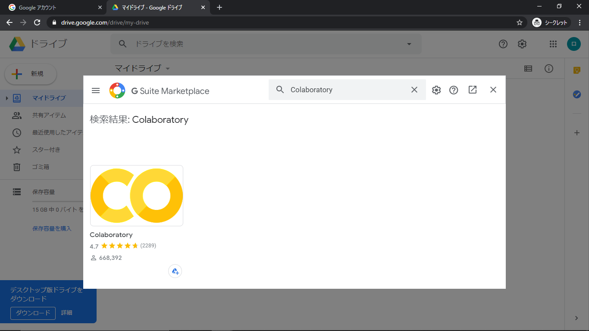
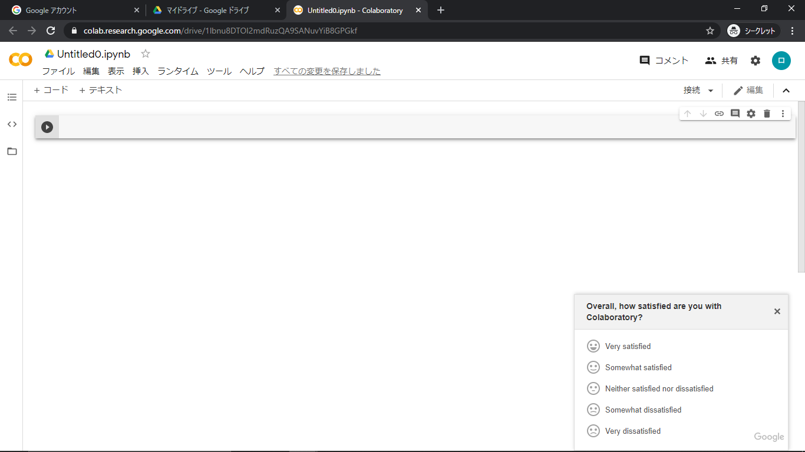
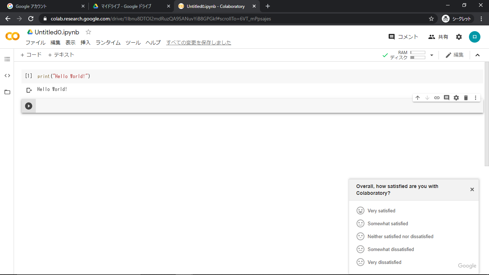
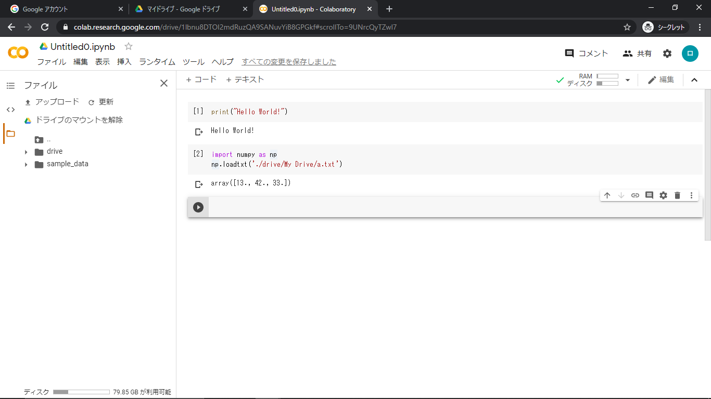

# GoogleColaboratoryの使い方

## Google Colaboratoryとは？

Googleが提供するJupyter notebookをクラウドで使用することができるサービス．Jupyter NotebookはPythonの実行環境の一つであり，環境構築をせずに簡単にPythonを動かすことができる．また，GPUを無料で使うことができ，Google Driveとの連携も可能である．ただし，12時間ルールと90分ルールと呼ばれるサービスの利用制限がある．

- 90分ルール: アイドル状態が90分続く場合に停止
- 12時間ルール: 連続使用は最大12時間

主なスペックは以下の通りである．

- OS: Ubuntu 18.04
- CPU: 2.2GHz
- RAM: 13GB
- GPU: 12GB or 16GB
- Notebookのサイズ: 20MB

## Google Colaboratoryの設定方法

1. Googleアカウントにログインし，Google Driveを開く
2. 左にあるメニューから「新規」→「その他」→「アプリを追加」をクリック
3. 「Colaboratory」と検索して、インストールする

4. 「新規」 → 「その他」→「Google Colaboratory」をクリックし、Jupyter Notebookを起動

5. セルにprint('Hello World!')を入力
6. 「Shift + Enter」を押し，コードが動作することを確認

## Google Driveとの同期方法

1. 左側のメニューにある「ファイル」タブにある「ドライブをマウント」をクリック
2. 「./drive/My Drive」がマイドライブのパスになる
3. 以下は，マイドライブに保存したa.txtをPythonで読み込んだ例

## R言語の実行方法

Google ColaboratoryではR言語も実行できる
